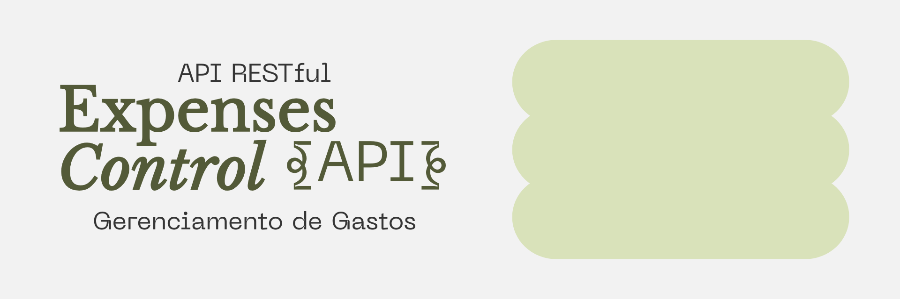

# Expenses Control { API } • Gerenciamento de Gastos

## 📖 Visão Geral do Projeto

O **Expenses Control** é uma API RESTful desenvolvida em Node.js focada no gerenciamento de finanças pessoais. O sistema permite o cadastro de usuários com autenticação segura e a gestão completa (CRUD) de categorias e despesas, aplicando conceitos avançados de filtros e rotas de dashboard estatístico.

O projeto foi construído seguindo rigorosamente o **Padrão Arquitetural MVC** (Model-View-Controller) e utiliza um banco de dados relacional (MySQL) gerenciado através do ORM Sequelize.

---

## 🚀 Tecnologias Utilizadas

- **Node.js & Express.js**: Construção do servidor e roteamento.
- **MySQL & Sequelize**: Banco de dados relacional e ORM (com uso de Migrations e Seeders).
- **Autenticação JWT**: Segurança das rotas privadas utilizando JSON Web Tokens.
- **Bcrypt**: Criptografia de senhas no banco de dados.
- **Dotenv**: Gerenciamento de variáveis de ambiente de forma segura.

---

## ⚙️ Instruções para Rodar o Projeto

### Pré-requisitos
* **Node.js** instalado na máquina.
* **MySQL** rodando localmente (ex: XAMPP, MySQL Workbench).

### Passo a Passo

1. **Clone o repositório:**
   ```bash
   git clone [https://github.com/GabrielMuehlbauer/expenses-control-api.git](https://github.com/GabrielMuehlbauer/expenses-control-api.git)
   cd expenses-control-api
   ```

2. **Instale as dependências:**
   ```bash
   npm install
   ```

3. **Configuração do Banco de Dados (.env):**
   Crie um arquivo `.env` na raiz do projeto contendo as credenciais do seu banco de dados MySQL local. *Certifique-se de criar o banco de dados previamente no seu gerenciador (ex: `CREATE DATABASE expenses_control;`)*.

4. **Construção das Tabelas (Migrations):**
   Rode o comando abaixo para que o Sequelize construa toda a arquitetura de tabelas automaticamente:
   ```bash
   npx sequelize-cli db:migrate
   ```

5. **População Inicial (Seeders):**
   Rode o comando abaixo para criar o usuário Administrador padrão e as Categorias iniciais:
   ```bash
   npx sequelize-cli db:seed:all
   ```
   * **Login Admin Gerado:** `admin@expensescontrol.com`
   * **Senha:** `admin123`

6. **Inicie o servidor:**
   ```bash
   npm run dev
   ```
   O servidor estará rodando em: `http://localhost:3000/`

---
